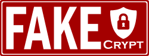

# FakeCrypt

Become in Certificate Authority and sing your own valid certificates

## Why Become in your own CA

Sometimes you need several certificates for your machines , and you are tired of deal with invalid certificates exceptions, showed in connections or browsers when you are testing a local enviroment with SSL/HTTPS or even in your local network.

Becoming in your own CA, you can sing several certificates for your diferents host/domains, and you only need import your your `rootCA.crt` file in your system to validate all your signed certificates.

TODO: Image


## TL;TR

```sh
$>wget https://raw.githubusercontent.com/scaamanho/fakecrypt/main/fakecrypt
$>sudo mv fakecript /usr/local/bin
$>fakecrypt
```

Response all questions and install generated certificates

All your certificates files will be store in `$HOME/fakecrypt/` directory.

## Create your own CA

This step mus be only runned once, and is highly recomendable keep a backup of directories `$HOME/fakecrypt/rootCA` and `$HOME/fakecrypt/CA` due is where your CA certificates resides.

First time you run `fakecrypt` will be promted that any CA was found and ask if you want create one.

Default values are prompted, if you not set any value, default will be used.

You can rerun CA creation executing:

```sh
$>fakecrypt ca create

Country Name [ME]:
City Name [Podgorica]:
Root Common Name [Fake Root CA]:
CA Organization Name [Fake Networks]:
CA Name [Signatures Department]:
CA Common Name [Fake Networks CA]:

Creating ROOT CA CERTIFICATE
....
Creating INTERMEDIATE CA CERTIFICATE
....

```

## Sing your own domains certificates

Once you run `createCA.sh` now you can create your domain certificates for all domains that you want.

For that run `domainCertificate.sh` this will pront for domain name, and all your files and certificates needed for this domain will be under `certs/domain-name.ext`. If any domain name are provided, the default domain `vcap.me` will be used.

```sh
$>fakecrypt
Domain Name [vcap.me]:
Generating a RSA private key
...
                DNS:*.vcap.me, DNS:*.m.vcap.me, DNS:vcap.me
All cerficate files are in certs/vcap.me folder
```

This script allow domain name use subdomains


### Domains that point to 127.0.0.1

These domains point to localhost, and can be used generate your local machine certificates

* [*.]localtest.me
* [*.]127-0-0-1.org.uk
* [*.]vcap.me
* [*.]yoogle.com
* [*.]lvh.me
* [*.]lacolhost.com
* domaincontrol.com
* [*.]127.0.0.1.xip.io

### Custom Domains

If you need customize your own domains with multiple machines in a local network, you can register domains or subdomains for free in:

* <https://my.freenom.com/>
* <https://www.dynu.com/>
* <https://www.duckdns.org/> - Can't use subdomains feature.
* [*.][host_ip].xip.io

and point them to your machines.

## Import Certificate Authorities in your System
[TODO:]
### Debian/Ubuntu

```sh
sudo mkdir /usr/local/share/ca-certificates/extra
sudo cp rootCA.crt /usr/local/share/ca-certificates/extra/
sudo update-ca-certificates
```

### CentOS/RHEL

```sh
cp rootCA.crt /etc/pki/ca-trust/source/anchors/
update-ca-trust extract
```

### Windows

#### Chrome/Edge/IE

Chrome, Edge, and Internet Explorer use the Windows certificate store.

To import the certificate to the Windows certificate store, follow these steps:

Copy the rootCA.crt certificate file to the computer.
Double-click the certificate file.
Select Install Certificate.
Select Local Machine and then Next.
Select Place all certificates in the following store, and then Browse.
Select Trusted Root Certification Authorities and then Next.
Select Finish.

#### Firefox

Firefox uses its own certificate manager.

Copy the rootCA.crt certificate file to the computer.
Open Tools > Options.
Select Privacy & Security and browse to Certificates.
Select View Certificates.
Go to the Authorities tab.
Select Import.
Browse to the rootCA.crt certificate file and select Open.
Select Trust this CA to identify websites.
Select OK.
### Android

### Mac

### iOS

## Config your domain certificate in your server
[TODO:]
### NGINX

### Traefik


## How to customize FakeCrypt

[TODO:]

## Backup your data

[TODO:]


## References

[Creating TLS/SSL certificates for ThreatShield](https://help.f-secure.com/product.html#business/threatshield/latest/en/concept_E8E015C30E05412190F22C5DFC36AC0B-threatshield-latest-en)
[How to Create Your Own SSL Certificate Authority for Local HTTPS Development](https://deliciousbrains.com/ssl-certificate-authority-for-local-https-development/)